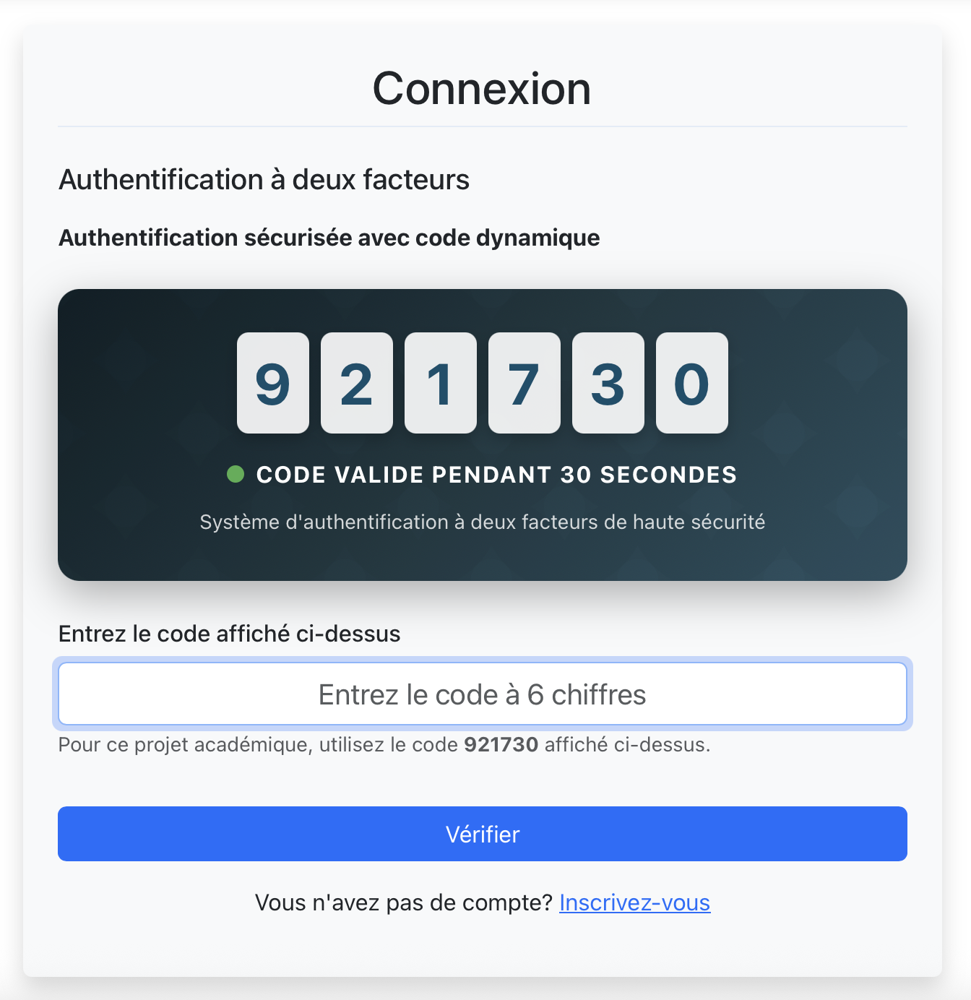
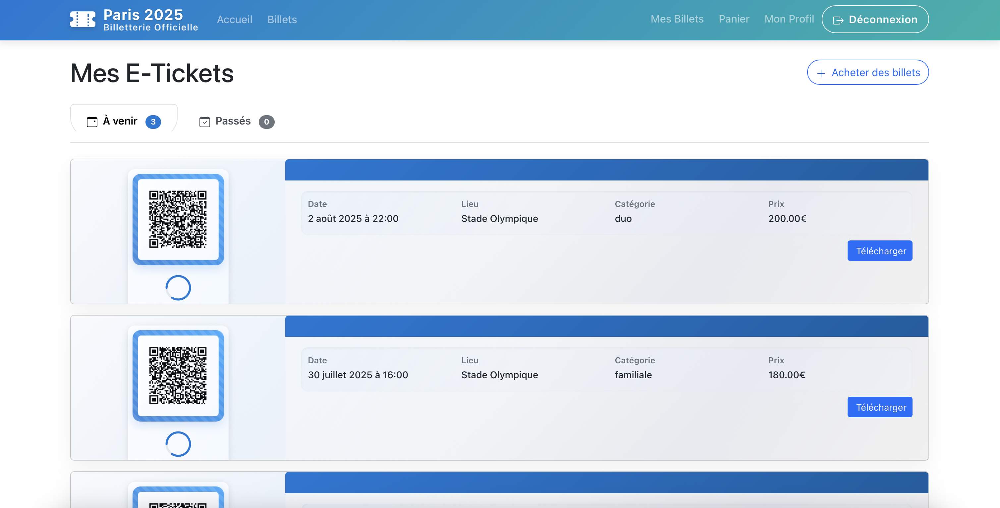
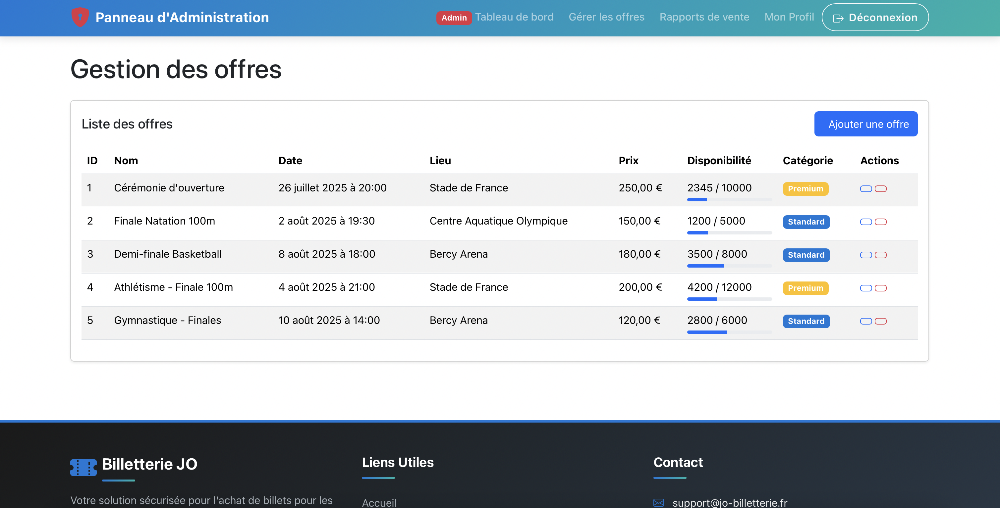
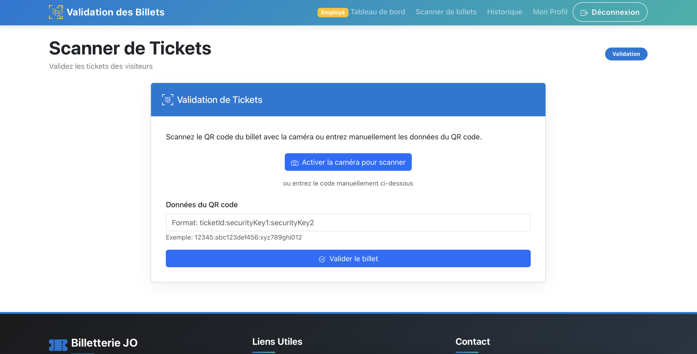

# Système de Billetterie Électronique pour les Jeux Olympiques

Ce projet vise à remplacer le système de billetterie physique des Jeux Olympiques par une solution de e-tickets sécurisée. Cette initiative est motivée par la nécessité de prévenir la fraude et de moderniser le processus de vente et de validation des billets.

## Architecture

Le projet est structuré en microservices :

- **Service d'Authentification** : Gestion des utilisateurs, authentification MFA, génération de la première clé de sécurité
- **Service de Billetterie** : Gestion des tickets, génération des QR codes et de la deuxième clé de sécurité
- **Service d'Administration** : Gestion des offres, visualisation des ventes
- **Service de Validation** : Validation des tickets sur site
- **API Gateway** : Point d'entrée centralisé pour tous les services
- **Frontend** : Interface utilisateur React

## Fonctionnalités

### Pour les Visiteurs (Front-Office)
- Navigation et consultation des offres de tickets
- Création de compte et authentification sécurisée avec MFA obligatoire
- Achat de tickets avec génération de QR codes sécurisés
- Réception et gestion des e-tickets

### Pour l'Organisation (Back-Office)
- Gestion des utilisateurs
- Stockage sécurisé des clés de sécurité
- Validation des e-tickets sur site
- Authentification des employés

### Pour l'Administration
- Gestion des offres de tickets
- Visualisation des ventes et statistiques

## Captures d'écran

### Interface utilisateur


*Page d'accueil présentant les offres de billets disponibles*


*Configuration de l'authentification multi-facteurs*

### Billets et QR Codes


*Exemple de billet électronique avec QR code*

### Interface d'administration


*Tableau de bord d'administration avec statistiques de vente*


*Interface de validation des billets pour les employés*

## Sécurité

Le système implémente plusieurs couches de sécurité :
- Authentification Multi-Facteurs (MFA) obligatoire
- Politique de mots de passe robustes
- Système à deux clés pour la génération des e-tickets
  - Première clé générée lors de la création du compte (invisible pour l'utilisateur)
  - Deuxième clé générée lors de l'achat du billet
- Communication cryptée (HTTPS/TLS)
- Protection contre les attaques automatisées

## Technologies Utilisées

- **Backend** : FastAPI 0.110.0+, SQLAlchemy 2.0+, Pydantic v2
- **Base de données** : SQLite (développement), PostgreSQL (production)
- **Cache** : Redis
- **Sécurité** : Passlib, PyJWT, PyOTP (MFA)
- **QR Codes** : qrcode, Pillow
- **Frontend** : React, Bootstrap, React Router
- **Conteneurisation** : Docker, Docker Compose
- **Tests** : pytest, pytest-cov, Locust (tests de charge)

## Prérequis

- Python 3.13+
- Node.js 16+
- Docker et Docker Compose (pour le déploiement)
- SQLite (pour le développement local)
- PostgreSQL (pour la production)

## Installation

### Méthode 1 : Installation locale pour le développement

1. Cloner le dépôt :
   ```bash
   git clone <url-du-depot>
   cd bloc3
   ```

2. Créer un environnement virtuel et l'activer :
   ```bash
   python -m venv venv
   source venv/bin/activate  # Sur Windows : venv\Scripts\activate
   ```

3. Installer les dépendances principales :
   ```bash
   pip install -r requirements.txt
   ```

4. Configurer les variables d'environnement :
   ```bash
   # Copier le fichier .env.example en .env et modifier les valeurs selon votre environnement
   cp .env.example .env
   ```

5. Installer les dépendances du frontend :
   ```bash
   cd frontend
   npm install
   cd ..
   ```

### Méthode 2 : Installation avec Docker

1. Cloner le dépôt :
   ```bash
   git clone <url-du-depot>
   cd bloc3
   ```

2. Configurer les variables d'environnement :
   ```bash
   # Copier le fichier .env.example en .env et modifier les valeurs selon votre environnement
   cp .env.example .env
   ```

3. Construire et démarrer les conteneurs :
   ```bash
   docker-compose up -d
   ```

## Démarrage

### Méthode 1 : Démarrage local pour le développement

1. Démarrer tous les services en mode développement :
   ```bash
   ./start-dev.sh
   ```

2. Accéder aux différents services :
   - Frontend : http://localhost:3000
   - API Gateway : http://localhost:8080
   - Service d'authentification : http://localhost:8000/docs
   - Service de billetterie : http://localhost:8001/docs
   - Service d'administration : http://localhost:8003/docs
   - Service de validation : http://localhost:8002/docs

### Méthode 2 : Démarrage avec Docker

1. Si les conteneurs ne sont pas déjà en cours d'exécution :
   ```bash
   docker-compose up -d
   ```

2. Accéder aux différents services :
   - Frontend : http://localhost:3000
   - API Gateway : http://localhost:8080
   - Service d'authentification : http://localhost:8000/docs
   - Service de billetterie : http://localhost:8001/docs
   - Service d'administration : http://localhost:8003/docs
   - Service de validation : http://localhost:8002/docs

## Tests

### Tests Unitaires et d'API

1. Exécuter les tests unitaires :
   ```bash
   # Activer l'environnement virtuel si ce n'est pas déjà fait
   source venv/bin/activate
   
   # Exécuter les tests avec couverture
   pytest --cov=services
   ```

2. Générer un rapport de couverture HTML :
   ```bash
   pytest --cov=services --cov-report=html
   ```

### Tests d'Intégration

```bash
# Exécuter les tests d'intégration
./run_integration_tests.sh
```

### Tests de Charge

Le projet inclut des tests de charge pour vérifier la capacité du système à gérer des millions d'utilisateurs simultanés, ce qui est crucial pour un système de billetterie des Jeux Olympiques.

1. Installer Locust :
   ```bash
   pip install locust
   ```

2. Exécuter les tests de charge avec l'interface web :
   ```bash
   cd load_tests
   locust -f locustfile.py
   ```
   Puis accéder à http://localhost:8089 dans votre navigateur.

3. Ou exécuter les tests de charge en ligne de commande :
   ```bash
   cd load_tests
   ./run_load_tests.sh
   ```
   
   Options personnalisées :
   ```bash
   # ./run_load_tests.sh [HOST] [USERS] [SPAWN_RATE] [RUNTIME]
   ./run_load_tests.sh http://localhost:8000 1000 50 300
   ```

Les tests de charge simulent différents types d'utilisateurs :
- Utilisateurs standard (inscription, navigation, achat de billets)
- Employés de validation (validation des billets sur site)
- Administrateurs (consultation des statistiques)

## Déploiement en production

1. Configurer les variables d'environnement pour la production dans le fichier `.env`

2. Construire et déployer avec Docker Compose :
   ```bash
   docker-compose -f docker-compose.yml -f docker-compose.prod.yml up -d
   ```

### Comptes pré-configurés

L'application est livrée avec deux comptes pré-configurés pour faciliter les tests :

#### Compte Administrateur
- **Email**: admin@example.com
- **Mot de passe**: Admin123!
- **Droits**: Accès complet au tableau de bord d'administration, gestion des offres, visualisation des ventes

#### Compte Employé
- **Email**: employee@example.com
- **Mot de passe**: Employee123!
- **Droits**: Accès à l'interface de validation des billets

> **Note de sécurité**: Ces comptes sont destinés uniquement aux tests. Pour un environnement de production réel, il est fortement recommandé de supprimer ou de modifier les mots de passe de ces comptes après le déploiement initial.

## Documentation

Le projet dispose de plusieurs types de documentation :

### Documentation API (Swagger/OpenAPI)

Chaque service expose sa documentation API via Swagger UI, accessible aux endpoints `/docs` :
- Service d'authentification : http://localhost:8000/docs
- Service de billetterie : http://localhost:8001/docs
- Service de validation : http://localhost:8002/docs
- Service d'administration : http://localhost:8003/docs

### Documentation du Code (Sphinx)

Le projet utilise Sphinx pour générer une documentation HTML à partir des docstrings du code Python :

1. Générer la documentation :
   ```bash
   ./generate_docs.sh
   ```

2. Consulter la documentation :
   Ouvrez le fichier `docs/build/html/index.html` dans votre navigateur.

### Wiki GitHub

Un wiki GitHub est disponible pour la documentation détaillée et évolutive du projet. Il contient :
- Guide de démarrage rapide
- Architecture du système
- Documentation des services
- Guide de sécurité
- FAQ

Accédez au wiki via l'onglet "Wiki" du dépôt GitHub.

### Fichiers de Documentation

- `API.md` : Documentation détaillée des API REST
- `TESTING.md` : Documentation des tests
- `docs/README.md` : Guide pour la documentation Sphinx

## Structure du projet

```
├── api-gateway/            # API Gateway pour centraliser les requêtes
├── frontend/               # Application frontend React
├── services/               # Services backend
│   ├── auth/               # Service d'authentification
│   ├── tickets/            # Service de billetterie
│   ├── admin/              # Service d'administration
│   └── validation/         # Service de validation
├── docs/                   # Documentation Sphinx
│   ├── source/             # Fichiers source de la documentation
│   └── build/html/         # Documentation HTML générée
├── load_tests/             # Tests de charge avec Locust
├── integration_tests/      # Tests d'intégration
├── .github/workflows/      # Workflows CI/CD
├── docker-compose.yml      # Configuration Docker Compose
├── .env                    # Variables d'environnement
├── init-db.sh              # Script d'initialisation de la base de données
├── start-dev.sh            # Script de démarrage en mode développement
├── generate_docs.sh        # Script de génération de la documentation
├── API.md                  # Documentation détaillée des API
├── TESTING.md              # Documentation des tests
└── README.md               # Documentation du projet
```

## Contribution

1. Forker le projet
2. Créer une branche pour votre fonctionnalité (`git checkout -b feature/amazing-feature`)
3. Committer vos changements (`git commit -m 'Add some amazing feature'`)
4. Pousser vers la branche (`git push origin feature/amazing-feature`)
5. Ouvrir une Pull Request

## Licence

Ce projet est sous licence [MIT](LICENSE).

## Comment ajouter vos propres captures d'écran

Pour ajouter vos propres captures d'écran au README :

1. Placez vos images dans le répertoire `assets/images/`
2. Référencez-les dans le README.md en utilisant la syntaxe Markdown :

```markdown

*Légende de l'image*
```

3. Pour les images plus grandes, vous pouvez contrôler la taille avec HTML :

```markdown

```

## Contact

Pour toute question ou suggestion, veuillez contacter l'équipe de développement.
